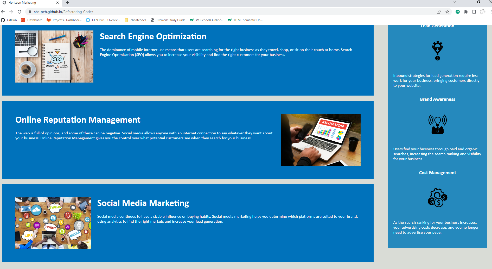

# Refactoring-Code

A marketing agency wanted a code base that follows the accessibility standards and is optismised for search engines.

In summary a refactoring of code is necessary.

## Screenshots

## Link to Deployed Application

https://shs-peb.github.io/Refactoring-Code/